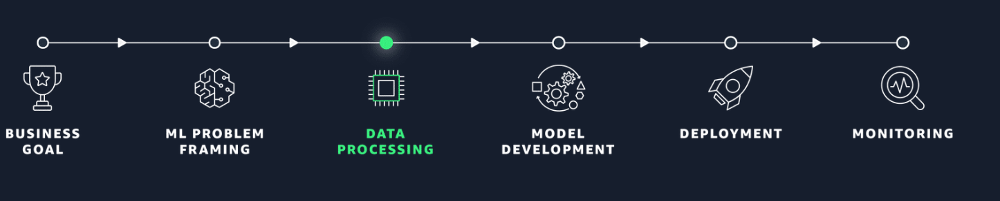

# AWS ML Engineer Associate 1.3 Validate Data and Prepare for Modeling

## Introduction

This module gives fundamental knowledge of how to prepare and configure your data for model training.
Explore services - AWS Glue Data Quality, AWS Glue DataBrew. 

## Notes
1. Data Validation and Pre-training Bias Metrics - 
2. One goal of data validation is to address potential bias in your datasets.
3. Class Imbalance - Monitoring such metrics of bias we can identify and mitigate biases before model training begin
4. Data integrity is a key factor in each step of the machine learning process - validate your data’s security.
5. Handling Class Imbalance - 
     1. Sampling Techniques - Oversampling or Undersampling.
     Over Sampling - increases samples of the minority class by replicating them or generating synthetic samples, 
     Undersampling - reduces samples of the majority class by deleting some. 
     2. Synthetic data generation- SMOTE -  SMOTE works by interpolating between existing minority class examples that are close together. This technique allows the minority class to be oversampled to balance the class distribution.
     3. Data Augmentation - Data augmentation involves creating new training data from existing data, such as by rotating, scaling, cropping, flipping, or adding noise to a dataset. data augmentation expands a dataset by using transformations on existing data.
     GAN - GANs consist of two neural networks, a generator, and a discriminator. The generator creates synthetic data from random noise, trying to make data that resembles the training data. The discriminator examines data to determine whether it is real or synthetic. This adversarial competition drives the generator to create increasingly realistic synthetic data as the discriminator provides feedback on how to improve

**AWS Glue Data Quality** - AWS Glue Data Quality is a managed service that helps users continuously monitor and improve the quality of data

i. Write Data Quality Rule - Define custom rules using SQL to check data quality issues
ii. Automate run of Data Quality Rule
iii.  Data Quality Dashboards

**AWS Glue DataBrew**

AWS Glue DataBrew is a **visual data preparation** tool that makes it convenient for users to clean and normalize data for analysis
i. Data profiling - Automatically generate statistical visualizations ex. missing values, skewing and outliers. 
ii. Built-in transformations - Access over 350 build in transformation for common data-quality tasks like filling missing values, removing duplicates, and formatting data.

iii. Custom transformations - Create custom Python transformations to handle complex data quality requirements.

Indirect AWS Service Usage for Data Preparation - **AWS Comprehend**
Amazon Comprehend is a natural language processing (NLP) service that can be used to extract insights and information from unstructured text data
        Usecases - 

        Entity recognition
        Language Detection
        Topic Modeling 

AWS Services for detecting and Mitigating bias - **AWS Sagemaker Clarify**

        Bias Analysis
        Outlier Detection
        Explainability - SHAP visualization
        Data Insights

Reference video - https://www.youtube.com/watch?v=jvcPZmnXaxo

You will get pre-training bias metrics from AWS Sagemaker Clarify 
        
        facet is specified on analysis column.
        facet are nothing but the conditions which I'm interested in, the values I'm interested in and the label for which this facet is defined.
Sagemaker XAI Analyzer.

    Bias Report - Negative value implies whether this column analyzed for bias is represented less
    Positive value implies that the column analyzed for bias is most represented.

Data Security and Complaince 
    1. Securing Data using AWS encryption service - AWS KMS, Amazon EBS, Amazon S3, Amazon RDS
    Redshift, ElasticCache, AWS Lambda, Amazon Sagemaker.

Implications of data compliance requirements:
Personal Identifiable Information
HIPAA
PHI
Data residency
