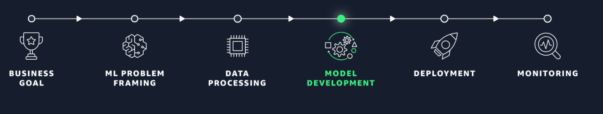

# AWS ML Engineer Associate 2.1 Choose a Modeling Approach

## Module Objective

1. Know the benefits and usecases for each AWS AI ML stack.
2. Explain how AI helps in solving the problem much easier than before. 
3. Select AWS AI solutions for solving common business problems
4. Benefits of using AWS Sagemaker for ML.
5. Identify specific usecases for Amazon Sagemaker buit-in algorithm.
6. Select most appropriate ML algorithm for an usecase.
7. Identify specific use cases for pre-trained Amazon SageMaker JumpStart Machine Learning solutions.
8. Choose the most appropriate Amazon SageMaker JumpStart built-in Machine Learning solution to solve common business needs.
9. Describe the role interpretability plays during model or algorithm selection.
10. Select most cost efficient model.